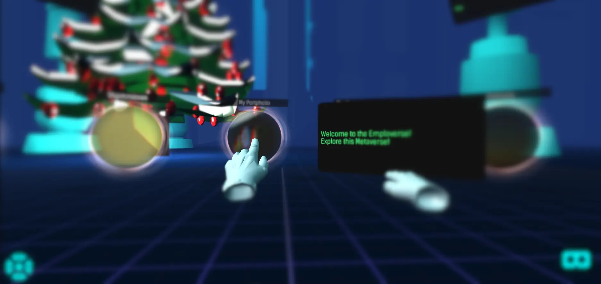

# CharlesDerek

 

  

    
  

  <h2>About Me 🚀</h2>
  
I'm Charles, a tech enthusiast at the crossroads of VR, AI, and platform development. I’m driven by creating immersive experiences and ensuring secure, scalable digital environments.

  <h3>Passions & Focus:</h3>
  

    
  

  <ul style="list-style-position: inside; padding: 0; margin: 0 auto; display: inline-block; text-align: left;">
    <li><strong>VR & AI</strong>: Crafting transformative solutions by blending virtual reality with artificial intelligence.</li>
    <li><strong>Platform Development</strong>: Building efficient, scalable systems with a focus on cloud and data center security.</li>
  </ul>
  <h3>Collaboration & Innovation:</h3>
  
I’m eager to connect with others who share my grit, work ethic, and passion for innovation.

  
Check out my projects and let’s spark something amazing together.

   

  

  

    
    
  

   
  

    
    <!--  -->
  

  
Top Skills

  

  
Other Skills

  

   

  

